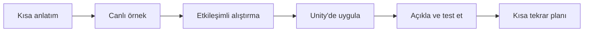
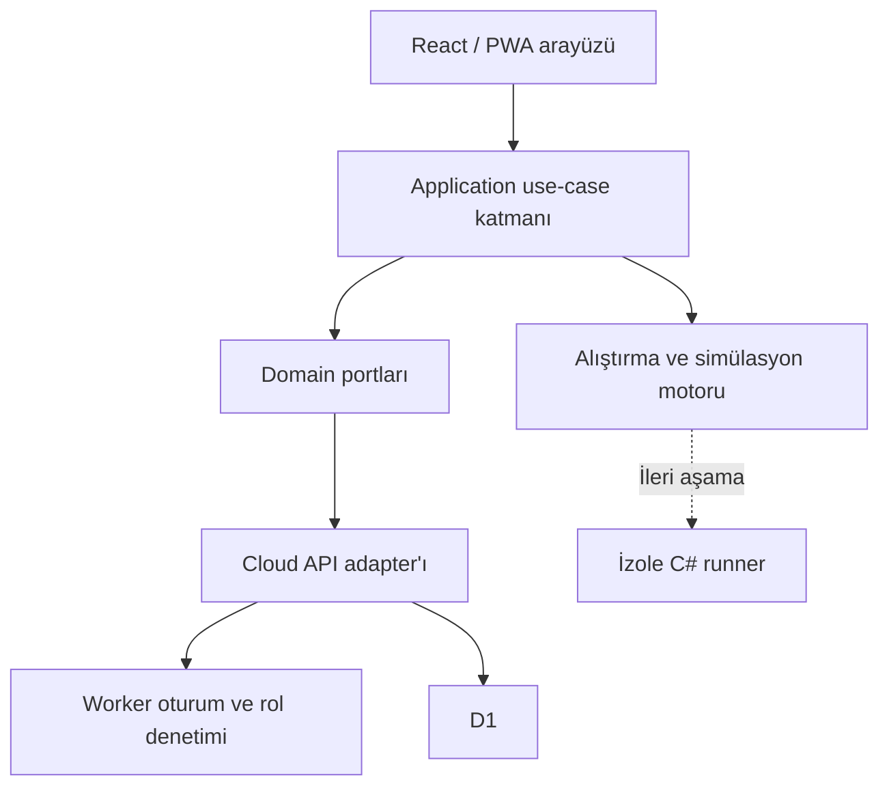

# Unity Öğrenme Platformu — Ürün ve Teknik Plan

## 1. Ürün tanımı

Bu proje, canlı eğitmeni devreden çıkarmayan; eğitmenin anlatımını etkileşimli alıştırmalar, kod laboratuvarı, fizik/oyun simülasyonları, proje takibi, ödevler ve düzenli tekrarlarla güçlendiren çok öğrencili bir Unity ve C# öğrenme platformudur.

Platform yalnızca mevcut öğrenci için hazırlanmayacaktır. Mevcut öğrencinin hızlı öğrenme ihtiyacı ilk “öğrenme yolu”nun şeklini belirler; altyapı ise daha sonra açılacak bütün öğrenci hesaplarını, farklı hızları ve farklı oyun projelerini destekler.

## 2. Hedef kullanıcılar

| Rol | Temel ihtiyaç | Ana ekranın önceliği |
|---|---|---|
| Öğrenci | Ne öğreneceğini, ne yapacağını ve nerede zorlandığını görmek | “Devam et” dersi, tekrar kuyruğu, proje checkpoint'i |
| Admin/Eğitmen | Öğrenci oluşturmak, ilerlemeyi görmek, ödev vermek ve hataları teşhis etmek | Öğrenci durumu, bekleyen incelemeler, riskli kavramlar |
| Gelecekte yardımcı eğitmen | Yetkili olduğu öğrencileri takip etmek | Sınırlı öğrenci ve içerik kapsamı |

İlk sürümde yalnızca `admin` ve `student` rolleri uygulanır.

## 3. Mevcut öğrenci için başlangıç profili

Öğrenci Unity Editor'da temel nesne işlemleri yapmış; `Collider`, `Transform`, `Rigidbody` ve `Trigger` kavramlarını yüzeysel olarak biliyor. C# tarafında `Debug.Log`, `if / else if / else`, `!` operatörü, `int` ve değişken gibi giriş kavramlarını görmüş fakat kodun neden çalıştığını açıklayacak güvene sahip değil.

Öğrencinin kısa vadeli baskısı, hâlihazırdaki kargo idle projesine katkı vermek ve bir oyun yayımlamaktır. Bu nedenle öğrenme yolu:

- uzun teorik C# bloğu bittikten sonra Unity'ye geçmez;
- her C# kavramını hemen küçük bir Unity davranışında uygular;
- mevcut kargo idle projesini kontrollü bir “ana proje” olarak kullanır;
- Asset Store paketini körlemesine yeniden kaplamak yerine kodu okuma, bağımlılık çıkarma, lisans ve performans denetimi, küçük değişiklik yapma ve sonucu açıklama becerisi kazandırır;
- vibe coding çıktısını kabul etmek yerine öğrenciye “oku, açıkla, değiştir, test et” döngüsü uygular.

## 4. Eğitim modeli

### 4.1 İlk yol: Hızlı Başlangıç

İlk öğrenci için hedef 20–25 saatlik canlı çalışma ve yaklaşık 25–30 kısa oturumdur. Bu sayı ürünün genel vaadi veya sabit kuralı değildir; öğrenci bazında atanabilen bir yol şablonudur.

Yüksek seviyeli akış:

1. Tanılama, araçlar, Unity proje düzeni, Git ve SourceTree
2. C# temelleri ile anında Unity uygulamaları
3. Unity lifecycle, input, Transform ve fizik
4. OOP, SOLID, event, interface ve sürdürülebilir oyun kodu
5. Idle/endless runner üretim kalıpları, UI, save ve ekonomi
6. Mobil performans, üçüncü parti paketler, DOTween ve hata ayıklama
7. Ana proje checkpoint'leri, build alma ve yayın öncesi kalite

Ayrıntılı ders başlıkları, süreler, ödev metinleri ve soru bankası sonraki aşamada hazırlanacaktır.

### 4.2 Bir dersin standart döngüsü



Bir kavram havada bırakılmaz. Örneğin `bool`, ekranda yalnızca tanım olarak görünmez; kapının açık/kapalı durumu, `Collider.isTrigger` seçimi veya bir üretim istasyonunun çalışıp çalışmadığı üzerinden gözlenebilir sonuca bağlanır.

### 4.3 Aralıklı tekrar

- Her kavram için mastery kaydı tutulur.
- İlk başarılı uygulamadan sonra 1, 3, 7 ve 14 günlük tekrar pencereleri başlangıç varsayımıdır.
- Yanlış veya yardım alınarak çözülen kavram daha erken geri gelir.
- Beşinci dersin içine birinci dersten mikro alıştırmalar karıştırılır.
- Tekrarlar aynı sorunun kopyası değildir; kavram farklı oyun bağlamında yeniden çağrılır.

### 4.4 Puanlama

İki ayrı gösterge kullanılır:

| Gösterge | Ne ölçer | Neyi ölçmez |
|---|---|---|
| XP | Düzenli çalışma ve tamamlanan etkinlik | Gerçek teknik yeterlilik |
| Mastery | Kavramı yardımsız uygulama, açıklama ve transfer etme | Sadece derse girme veya tıklama |

Önerilen mastery bileşimi:

- %40 doğrulanmış kod ve simülasyon alıştırmaları
- %25 aralıklı tekrar başarısı
- %25 proje checkpoint değerlendirmesi
- %10 kodu sözlü/yazılı açıklama ve hata ayıklama

Admin bu ağırlıkları yol şablonu bazında değiştirebilir.

## 5. Ana ürün yüzeyleri

### 5.1 Giriş

- Tek bir giriş ekranı bulunur.
- Kayıt ol bağlantısı bulunmaz.
- Başarılı girişten sonra rol claim'i okunur ve doğru panele yönlendirilir.
- Şifre sıfırlama admin politikasına göre e-posta üzerinden yürür.

### 5.2 Öğrenci paneli

- Bugün devam edilecek ders
- Öğrenme yolu ve düğüm durumları: kilitli, hazır, devam ediyor, tekrar zamanı, tamamlandı
- Yaklaşan ödev ve ana proje checkpoint'i
- Mastery haritası ve son hatalar
- Eğitmenin kısa geri bildirimi
- PWA çevrimdışı durumu ve senkronizasyon bilgisi

Mobilde Duolingo'nun kullanım kolaylığından alınacak esaslar; tek baskın görev, büyük dokunma alanı, aşağıdan erişilen sınırlı navigasyon ve net ilerleme hissidir. Görsel dil çocuklara yönelik olmayacaktır.

### 5.3 Ders çalışma alanı

Desktop düzeni ihtiyaca göre:

- anlatım/kavram paneli;
- kod veya simülasyon çalışma alanı;
- test sonucu, ipucu ve kavram denetçisi.

Mobilde bu yapı üst üste üç panel olarak sıkıştırılmaz. “Öğren → Dene → Sonuç” adımlarına dönüşür ve kullanıcının bağlamı korunur.

Alıştırma türleri:

- eşleştirme ve sıralama;
- kod boşluğu tamamlama;
- Monaco tabanlı kod yazma;
- hatalı kodu teşhis etme;
- değişken değerlerini canlı izleme;
- 2D fizik sandbox'ı;
- gerektiğinde lazy-load edilen 3D sahne;
- Unity Editor görev kontrol listesi;
- “bu kodu kendi cümlenle açıkla” görevi.

### 5.4 Admin paneli

- Öğrenci hesabı oluşturma, devre dışı bırakma ve şifre sıfırlama
- Öğrenme yolu atama
- Ders ve ödev yayınlama
- Gönderi inceleme, puan ve geri bildirim
- Öğrenci bazlı mastery, hata kümeleri ve tekrar borcu
- Proje checkpoint'leri
- İçerik sürümü ve yayın durumu

Öğrenci oluşturma işlemi istemci tarafında yapılmaz. Admin oturumunu doğrulayan Worker rotası kullanıcıyı güvenli ortamda oluşturur ve `student` rolünü atar.

## 6. Teknik mimari kararı

### 6.1 Ücretsiz sunucu mimarisi

İlk sürüm ödeme yöntemi istemeyen Cloudflare katmanında çalışır:

- Worker ile kimlik doğrulama, rol ve korumalı API işlemleri;
- D1 ile kullanıcı, ilerleme, etkinlik, ödev ve bildirim kayıtları;
- salt + pepper + PBKDF2 ile parola türetme;
- hash'lenmiş, süreli ve sunucudan iptal edilebilir oturum belirteçleri;
- yerel D1 ile güvenlik ve veri sahipliği testleri.

Kullanıcının yazdığı keyfî C# kodunu güvenli biçimde derleyip çalıştırmak için ileride ayrı, izole bir yürütme servisi gerekir. İlk sürümde tarayıcı içi sözdizimi/kural denetimi ve önceden tanımlı test senaryoları kullanılır.

### 6.2 Yayın modeli

- Frontend: GitHub Pages
- Backend: Cloudflare Worker + D1 Free
- CI/CD: GitHub Actions
- SPA yönlendirme: GitHub Pages uyumlu base path ve 404 fallback ya da hash tabanlı yönlendirme
- API CORS listesine GitHub Pages origin'i ve yerel geliştirme origin'i eklenir.

### 6.3 Bileşen sınırları



Önerilen kaynak düzeni:

```text
src/
  app/                 router, providers, boot
  domain/              saf tipler ve kurallar
  features/
    auth/
    student-dashboard/
    admin-students/
    learning-path/
    lesson-player/
    assignments/
    review-queue/
  services/
    cloudflareGateway.ts
    dataGateway.ts
  simulations/
    code/
    physics-2d/
    scene-3d/
  shared/
    ui/
    i18n/
    hooks/
    utils/
worker/
  src/
  migrations/
```

## 7. Başlangıç veri modeli

| Koleksiyon | Amaç | Önemli alanlar |
|---|---|---|
| `users` | En az profil verisi | displayName, email, role, status |
| `learningPaths` | Yeniden kullanılabilir yol şablonu | title, locale, version, moduleIds |
| `enrollments` | Öğrenci-yol ilişkisi | userId, pathId, pace, status |
| `lessons` | Ders kabuğu ve aktivite sırası | moduleId, title, activityIds, version |
| `activities` | Etkileşim sözleşmesi | type, conceptIds, payload, validator |
| `attempts` | Öğrenci denemesi | userId, activityId, result, hintsUsed |
| `mastery` | Kavram yeterliliği | userId, conceptId, score, reviewAt |
| `assignments` | Ödev ve proje checkpoint'i | assigneeId, rubricId, dueAt, status |
| `submissions` | Metin/dosya/link gönderimi | assignmentId, studentId, artifacts |
| `feedback` | Eğitmen geri bildirimi | submissionId, authorId, rubricScores |

Gereksiz veri tutulmaz. Doğum tarihi, telefon, konum, cihaz parmak izi veya öğretim için zorunlu olmayan kişisel alanlar varsayılan modele eklenmez.

## 8. Güvenlik

- İlk admin kullanıcı kontrollü bootstrap ile atanır.
- Yeni kullanıcı oluşturma rotası doğrulanmış admin oturumu olmadan çalışmaz.
- Öğrenci yalnızca kendi enrollment, attempt, mastery, submission ve kendisine açık içerik kayıtlarını okuyabilir.
- Öğrenci kendi puanını, rolünü veya değerlendirme sonucunu yazamaz.
- İstek boyutu, veri biçimi ve veri sahipliği Worker üzerinde doğrulanır.
- Parola pepper'ı ve dağıtım anahtarları frontend'e veya kaynak koduna girmez.
- CORS izin listesi ve sıkı Content Security Policy üretimde etkinleştirilir.
- Kritik admin işlemleri için sınırlı audit kaydı tutulur; ayrıntılı davranış gözetimi yapılmaz.

## 9. Görsel yön

Referanslardaki güçlü yönler:

- aydınlık zemin ve koyu mor metin kontrastı;
- net içerik hiyerarşisi;
- turuncu vurgular;
- mobilde tek odaklı akış;
- küçük illüstrasyonlarla canlılık.

Doğrudan alınmayacak yönler:

- çocuk fotoğrafları ve çocuk dili;
- uzay karalamalarının gelişigüzel tekrarı;
- her alanın büyük, yumuşak kart hâline getirilmesi;
- sürekli yüzen dekorlar;
- ana işlevi aşağı iten pazarlama hero'su.

Yeni görsel tez: **aydınlık bir oyun geliştirme laboratuvarı**. Arayüz editör hassasiyetine, eğitim ürününün sıcaklığına ve mobil oyunun net geri bildirimine birlikte sahip olur.

Maskot, küçük modüler bir oyun geliştirme yardımcısı olarak tasarlanabilir. Yalnızca onboarding, başarı, hata ipucu ve boş durumlarda görünür; öğretim alanının yanında sürekli zıplamaz.

## 10. Motion ilkeleri

| Durum | Hareket | Süre |
|---|---|---|
| Buton geri bildirimi | 1 px yükselme veya kısa basma | 140–180 ms |
| Panel/rota geçişi | opacity + 8–16 px mekânsal devamlılık | 180–260 ms |
| Doğru cevap | kısa vurgu, parçacık bütçesi sınırlı | 350–550 ms |
| Yanlış cevap | sarsma yerine alan odaklama ve açıklama | 180–240 ms |
| Path ilerleme | çizginin bir sonraki düğüme kontrollü dolması | 450–700 ms |
| Simülasyon | fizik sonucunu gerçek zamanlı gösterir | görev süresince |

Animasyonlar `transform` ve `opacity` üzerinde çalışır; layout thrashing oluşturmaz. Görünmeyen veya arka planda kalan döngüler durur.

## 11. Performans bütçesi

- İlk girişte Monaco, Three.js, grafik ve ders motoru yüklenmez.
- Her ağır alıştırma bağımsız async chunk olur.
- İlk rota için hedef sıkıştırılmış JavaScript bütçesi 180 KB civarıdır; uzak API entegrasyonu sonrası ölçülerek güncellenir.
- Görseller responsive AVIF/WebP, sabit ölçülü ve lazy-load edilir.
- 3D canvas gerektiğinde açılır, DPR sınırı uygulanır ve sahne kapanırken GPU kaynakları temizlenir.
- Skeleton yalnızca gerçek bekleme varsa gösterilir; 300 ms altı işlemlerde parlayan loader kullanılmaz.
- Core Web Vitals hedefi: LCP ≤ 2.5 s, INP ≤ 200 ms, CLS < 0.1.

## 12. Responsive ve PWA

- Mobil navigasyon en fazla beş ana hedef içerir.
- Admin tabloları mobilde yatay taşan masaüstü tablolarına dönüşmez; özet kart + detay sheet modeli kullanır.
- Kod editöründe mobil için tam ekran odak modu ve editör dışı alıştırma alternatifi bulunur.
- `viewport-fit=cover`, safe-area padding ve sanal klavye davranışı test edilir.
- PWA install, manifest, ikonlar, servis worker güncelleme akışı ve çevrimdışı durum mesajı sağlanır.
- Çevrimdışı yapılan destekli işlemler sıraya alınır; çatışma olduğunda sessizce veri ezilmez.

## 13. Aşamalı teslim

### Aşama 0 — Temel

- Repo, proje kuralları, seçilmiş skill'ler ve tasarım sistemi
- Ücretsiz Worker + D1 bağlantısı için hazırlık
- Uygulama kabuğu ve routing

### Aşama 1 — Kimlik ve iki panel

- Login
- Rol claim'i ve route guard
- Admin öğrenci oluşturma
- Öğrenci/admin dashboard iskeleti

### Aşama 2 — Eğitim motoru

- Yol, ders, aktivite ve attempt modeli
- Kod editörü ve ilk doğrulayıcı
- Puanlama ve mastery

### Aşama 3 — Ödev ve tekrar

- Ödev atama/gönderme/inceleme
- Aralıklı tekrar kuyruğu
- Admin analiz ekranı

### Aşama 4 — Simülasyon ve ana proje

- 2D fizik laboratuvarı
- Seçili 3D etkileşimler
- Öğrenci hedefine göre seçilen proje checkpoint'leri

### Aşama 5 — PWA, performans ve yayın

- Offline kabuk ve safe-area doğrulaması
- Playwright cihaz matrisi
- GitHub Actions ve GitHub Pages
- Worker yetki ve D1 migration üretim kapısı

## 14. Uygulama durumu ve sıradaki kapı

İlk çalışan arayüz dilimi tamamlandı:

- ortak giriş ekranı ve rol yönlendirmesi;
- öğrenci dashboard'u, öğrenme yolu ve ana proje checkpoint'i;
- admin dashboard'u, öğrenci listesi ve öğrenci oluşturma akışı;
- güvenli, kural tabanlı ilk C# kontrol deneyimi;
- Türkçe/İngilizce arayüz temeli;
- responsive uygulama kabuğu, safe-area kuralları ve PWA dosyaları;
- GitHub Pages yayın iş akışı;
- sağlayıcıdan bağımsız `DataGateway` sınırı ve geçici tanıtım adaptörü;
- Cloudflare Worker + D1 tabanlı güvenli canlı veri katmanı.

Cloudflare bilgileri eklendiğinde sıradaki üretim kapısı:

1. D1 veritabanı ve Worker dağıtımı;
2. sunucu taraflı gerçek oturum;
3. rol tabanlı API guard;
4. admin yetkisini sunucuda doğrulayan `createStudent` rotası;
5. D1 veri sahipliği ve oturum iptali testleri;
6. canlı API değişkeniyle tanıtım adaptörünün kapanması;
7. Playwright ile giriş, rol, öğrenci oluşturma ve cihaz matrisi.

Bu güvenlik kapısı tamamlanmadan gerçek öğrenci verisi tutulmaz. Ayrıntılı ders metinleri ve ağır 3D sahneler de bu kapıdan sonra dikey dilimler hâlinde geliştirilir.

## 15. İncelenen yaklaşım ve resmi kaynaklar

- Unity'nin resmi execution order dokümanı, lifecycle konularının ezber listesi yerine nesnenin sahneye girişinden fizik ve frame güncellemelerine uzanan zaman çizelgesiyle öğretilmesi gerektiğini destekler: [Order of execution for event functions](https://docs.unity3d.com/Manual/execution-order.html).
- Unity Learn'in proje üzerinden ilerleyen yaklaşımı, her kavramın gerçek bir sahne davranışına bağlanması kararına temel oluşturur: [Unity Essentials Pathway](https://learn.unity.com/pathway/unity-essentials).
- Code Monkey'nin güncel C# yaklaşımındaki video + companion project + quiz + doğrudan kod yazılan interaktif alıştırma birleşimi incelendi. Platform bu yapıyı birebir kopyalamaz; canlı eğitmen geri bildirimi, mastery ve öğrencinin kendi Unity projesiyle birleştirir: [Learn C# from Beginner to Advanced](https://unitycodemonkey.teachable.com/p/learn-c-from-beginner-to-advanced).
- Worker secret'ları parola pepper'ı ve kurulum anahtarını kaynak kodundan ayırır: [Workers secrets](https://developers.cloudflare.com/workers/configuration/secrets/).
- D1 prepared statement ve bound parametreleri kullanıcı girdisini SQL metninden ayırır: [D1 prepared statements](https://developers.cloudflare.com/d1/worker-api/prepared-statements/).
- Git'in yalnızca komut ezberi olarak kalmaması için SourceTree üzerinden clone, commit, push, pull ve branch akışları gerçek ders projesinde uygulanır: [Commit, Push, and Pull](https://support.atlassian.com/sourcetree/kb/commit-push-and-pull-a-repository-on-sourcetree/).
